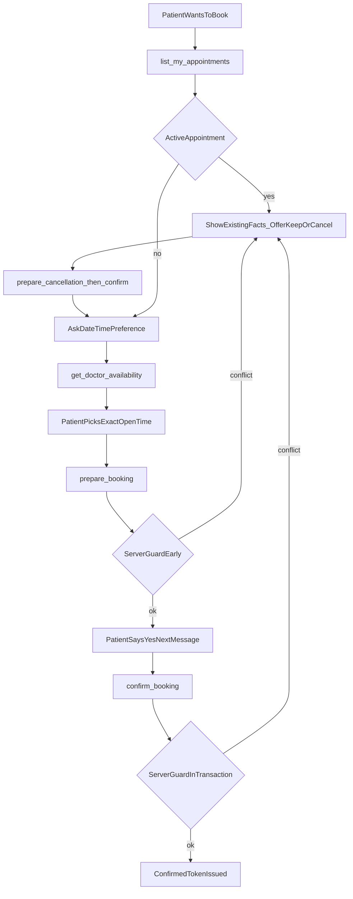

# Clinic Assistant: Booking Reliability Plan

## 1. Objective

Make the clinic assistant a reliable, professional receptionist for booking. After this work:

- One patient (identified by phone number) can hold **only one active appointment at a time**. This is enforced by the server, not just by the prompt.
- The bot never invents services, multi-service packages, fee totals, slots, or "booking ready" states.
- Every time, date, and fee the bot quotes comes from a tool result in the same turn.
- Draft summary and final confirmation carry the same facts (doctor, clinic, date, time, fee, payment).
- Replies follow the patient's own language and wording dynamically. No hardcoded token lists, glossaries, or reply templates.

## 2. Scope

In scope:
- Assistant package: [`assistant/prompts.py`](assistant/prompts.py), [`assistant/tools/booking.py`](assistant/tools/booking.py), [`assistant/tools/availability.py`](assistant/tools/availability.py), [`assistant/services/booking.py`](assistant/services/booking.py), [`assistant/services/slots.py`](assistant/services/slots.py)
- One opt-in domain guard in [`appointments/services.py`](appointments/services.py)
- Tests under [`assistant/tests/`](assistant/tests/)

Out of scope:
- Services/treatment catalog, per-service pricing, multi-slot bookings (single-appointment model is kept)
- Changes to `_ROMAN_URDU_TOKENS` or any language token/glossary
- WhatsApp FSM ([`whatsapp/fsm.py`](whatsapp/fsm.py)), doctor-side booking, and patient REST booking behavior (they keep today's rules)

## 3. Findings (from code and the reported chats)

- The assistant books one doctor + one slot + one flat `DoctorProfile.consultation_fee`. There is no services model. The "4 services", "all services in one visit", and unchanged 2000 fee were invented by the LLM.
- `book_token` only blocks the same patient + same doctor + same day. It does not stop one patient from holding several upcoming appointments. This is why the bot offered "cancel that and book the other two slots" and "keep it and book 8:00 PM and 8:30 PM".
- `prepare_booking` does not check for an existing appointment at all, so the conflict only surfaces at confirm time. That explains "slot available" followed by "sorry, you already have a booking".
- `confirm_summary` carries doctor, clinic, date, time, fee, payment. `confirm_booking` omits `payment`. Wording therefore drifts between "pay cash at the clinic" and "cash at the clinic".
- Open slots already exclude non-cancelled booked times in [`appointments/services.py`](appointments/services.py). Stale or wrong times come from the model not calling tools, plus zero-open dates counting toward the 5-date horizon.
- Greeting "khidmat" vs "service" and 7:30 vs "7:00-9:00 window" confusion are LLM phrasing problems, fixable by policy.

## 4. Business rule: one active appointment per patient

Definition:
- Patient identity: the phone number of the chat session (`ctx.phone`), resolved via the existing patient lookup.
- Active appointment: `Appointment.status == UPCOMING` and `token_date >= today` (Asia/Karachi), scoped to the current clinic (`ctx.clinic`). Same definition `list_my_appointments` already uses, so listing and enforcement agree.
- Cancelled and completed appointments do not count. After cancellation the patient may book again.

Behavior:
- If the patient has an active appointment, the bot does not start a new booking. It states the existing appointment facts from tools and offers only these paths: keep it, or cancel it (existing two-phase cancellation) and then book a new one.
- The bot never offers to book several slots, several doctors, or several days at once. A request like "book all slots" gets an honest explanation that one appointment can be held at a time.
- Rescheduling = cancel (patient confirms) then book (patient confirms). No new reschedule tool in this pass.

## 5. Design

### 5.1 Domain guard — [`appointments/services.py`](appointments/services.py)

- Add `class ActiveAppointmentExists(ValueError)` carrying the existing appointment. Subclassing `ValueError` keeps current callers working.
- Add helper `active_upcoming_appointment(patient, clinic)` returning the first active appointment or `None`.
- Add keyword-only argument `enforce_single_active: bool = False` to `book_token`. When true, inside the existing `transaction.atomic()` block and using `select_for_update`, raise `ActiveAppointmentExists` if the helper finds one. Defaulting to false leaves WhatsApp, doctor, and REST flows untouched.
- Checking inside the transaction closes the race between prepare and confirm, and between two near-simultaneous chats.

### 5.2 Tool layer — [`assistant/tools/booking.py`](assistant/tools/booking.py), [`assistant/services/booking.py`](assistant/services/booking.py)

- `book_cash_appointment` passes `enforce_single_active=True`.
- `prepare_booking`: before staging, look up the patient by phone (no patient creation before the patient has confirmed anything). If an active appointment exists, return `err("active_appointment_exists", ...)` with structured facts: `token_code`, `doctor`, `date_label`, `time_label`, `can_cancel`, `cancel_until` (reuse `cancel_flags`). Do not set pending.
- `confirm_booking`: catch `ActiveAppointmentExists`, clear pending, return the same error code and facts. Keep the existing `duplicate_booking` and `slot_taken` mapping for other `ValueError`s.
- Payload parity: `prepare` and `confirm` both return `clinic`, `payment` (one canonical value for cash-at-clinic), `fee`, and `fee_label` (consultation fee). The model localizes wording; tools stay facts only.
- Tool descriptions: `prepare_booking` only after the patient chose an exact open time returned by tools; `confirm_booking` only after an explicit yes in a later message.

### 5.3 Availability hygiene — [`assistant/services/slots.py`](assistant/services/slots.py), [`assistant/tools/availability.py`](assistant/tools/availability.py)

- `next_available_dates` drops dates with zero open slots so a full day cannot occupy the 5-date horizon.
- `get_doctor_availability` description states that returned `times` are the only bookable times and that clinic opening windows must not be presented as appointment times.

### 5.4 System policy — [`assistant/prompts.py`](assistant/prompts.py)

Extend `_policy()` with these rules (policy text only, no templates, no token lists):

- Language: reply in the language and style of the patient's latest message and mirror the terms they use (for example "khidmat" or "service" only when they used it). Stay professional in either language. `_ROMAN_URDU_TOKENS` and `detect_reply_language` stay as they are.
- One active appointment: at booking intent call `list_my_appointments` first. If one exists, follow section 4. Never offer multiple bookings.
- One visit model: one doctor, one exact slot, one consultation fee from tools. Treatments the patient names (check-up, filling, advice) are discussed at the visit; they are not separate bookable or billable items and never multiply the fee.
- Ask before scheduling: ask for preferred date/time, call `get_doctor_availability`, let the patient pick. Never auto-pick a slot or jump straight to prepare.
- Preference handling: "earliest", "afternoon", "last" (in whatever words the patient used) map only to times present in the tool result for that date. If nothing matches, say so and offer real alternatives.
- Window vs slot: quote only exact open times from tools. Never present "7:30 PM within 7:00-9:00" as an appointment time.
- Fresh facts: re-call availability before listing or re-offering times; never reuse a stale list from earlier in the chat.
- No fake states: never say ready, reserved, or confirmed unless the matching tool just returned ok. Draft and final messages echo tool facts, including clinic and payment, and keep the same payment meaning in both.
- Honest services answer: if asked how many services are selected or what each costs, say this system books one doctor consultation at the listed consultation fee and does not create separate service line items.
- Keep existing rules: no invented doctors/fees/times, explicit yes on a separate message, scope limits.

## 6. Traceability: reported issue to fix

- All services booking / multi-service fee stays 2000: honest one-visit policy (5.4). Fee stays the consultation fee by design.
- Services not shown on confirmation: policy forbids fake lists; confirmation shows tool facts (5.2, 5.4).
- 7:30 PM vs "7:00-9:00 window" confusion: window-vs-slot rule (5.4), availability description (5.3).
- Bot picked date/time itself: ask-before-scheduling rule (5.4).
- "Earliest" gave 7:00 PM, "afternoon" gave 7:00 PM: preference handling from tool times only (5.4).
- Booked slot shown available, then "already booked", then "available" again: fresh availability rule (5.4), early server guard in prepare (5.2), in-transaction guard in confirm (5.2).
- Offered to book several slots for one patient: one-active-appointment rule, server-enforced (4, 5.1, 5.2).
- "Pay cash at the clinic" vs "cash at the clinic": same `payment` field on prepare and confirm (5.2) plus consistency rule (5.4).
- Missing clinic/payment on final confirmation: payload parity (5.2).
- "khidmat" vs "service" drift: mirror-the-patient language rule; no glossary or tokens (5.4).
- Fully booked dates crowding the list: zero-open date filter (5.3).

## 7. Test plan

Unit/integration (Django tests under [`assistant/tests/`](assistant/tests/)):
- Domain: `book_token(..., enforce_single_active=True)` raises `ActiveAppointmentExists` when an upcoming appointment exists for that patient and clinic; passes after the first one is cancelled; passes when the first one is completed; passes when the other appointment is at a different clinic; default `False` keeps old behavior for other callers.
- Tool: `prepare_booking` returns `active_appointment_exists` with token/doctor/date/time/cancel facts and sets no pending; with no active appointment it behaves as before.
- Tool race: an appointment created between prepare and confirm makes `confirm_booking` return the same error and clear pending.
- Tool flow: cancel then prepare/confirm succeeds.
- Payload parity: `prepare` and `confirm` expose identical `clinic`, `payment`, `fee`, `fee_label`.
- Availability: dates with zero open slots are not returned.
- Policy: `_policy()` contains the one-active-appointment, ask-before-scheduling, window-vs-slot, and no-fake-state rules; `_ROMAN_URDU_TOKENS` is unchanged; existing language tests still pass.

Manual playground scenarios (Roman Urdu and English):
- New patient, names several treatments: bot says one consultation and one fee, asks for date/time, lists only tool times, summary and confirmation match.
- Patient with an active appointment asks to book again or book "all slots": bot states the existing appointment from tools and offers keep or cancel; no second booking is possible.
- Cancel then rebook in the same chat succeeds.
- "Earliest", "afternoon", "last slot" requests return times that actually match, or an honest "none match".
- Language follows the patient turn by turn, mirroring their own words.

## 8. Risks and mitigations

- LLM can still deviate from policy: the booking-critical rule (one active appointment) is enforced in code, not only by prompt. Other rules are prompt-level and are checked by the manual scenarios.
- Doctor-side or WhatsApp bookings can still create a second appointment for the same patient: accepted for this pass because the flag is opt-in; the same flag can be enabled on those paths later with one argument.
- Clinic-scoped definition of "active": a patient with an appointment at another clinic is not blocked here. Matches the assistant's per-clinic tenancy.
- Same-day past-slot appointments that are still `UPCOMING` count as active until completed or cancelled. Consistent with how `list_my_appointments` shows them.

## 9. Delivery order

1. Domain guard and helper (5.1) with tests.
2. Tool guard, payload parity, descriptions (5.2) with tests.
3. Availability filter (5.3) with tests.
4. Policy update (5.4) with tests.
5. Full test run, then manual scenarios from section 7.
